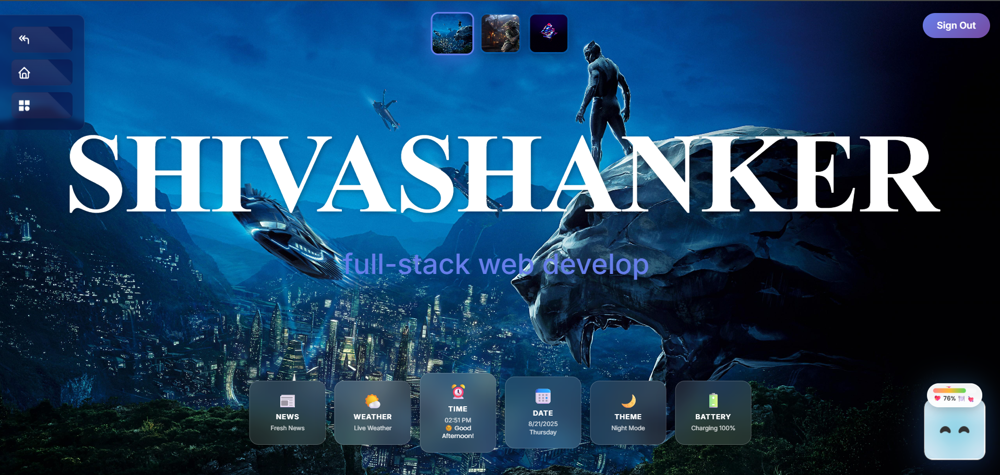
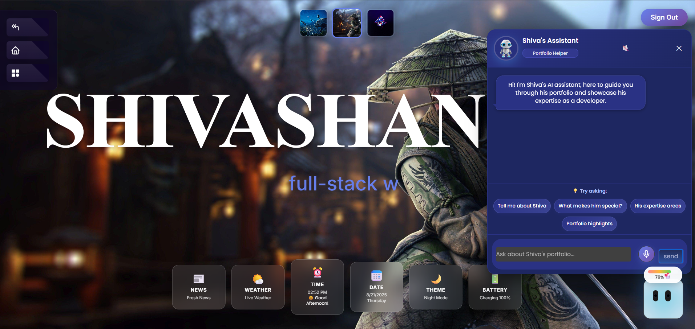
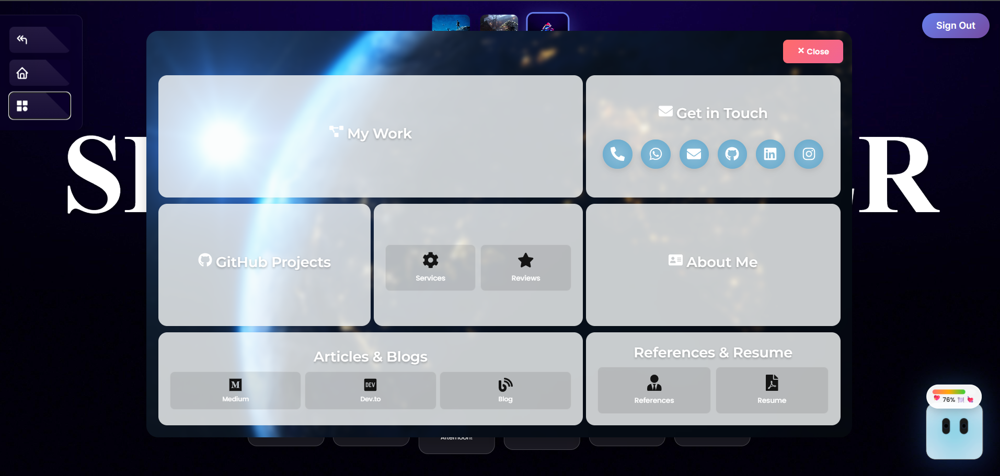
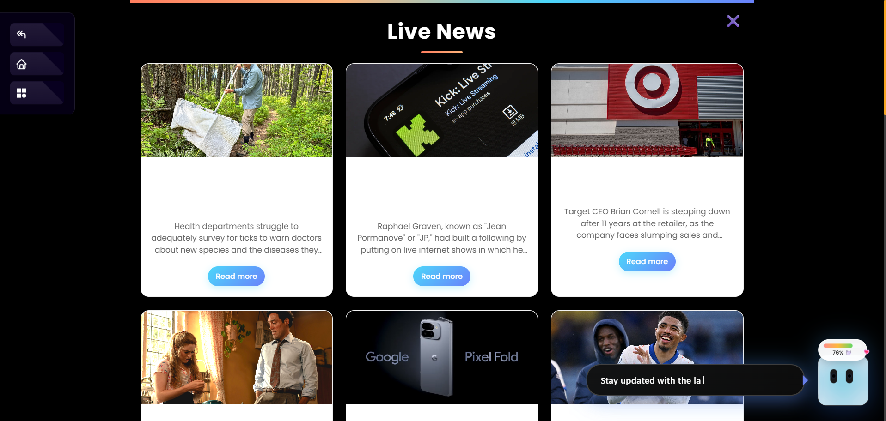
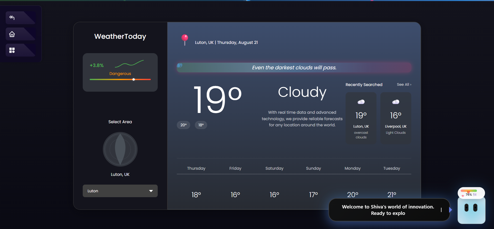

<div align="center">

```
███████╗██╗  ██╗██╗██╗   ██╗ █████╗ ███████╗██╗  ██╗ █████╗ ███╗   ██╗██╗  ██╗███████╗██████╗ 
██╔════╝██║  ██║██║██║   ██║██╔══██╗██╔════╝██║  ██║██╔══██╗████╗  ██║██║ ██╔╝██╔════╝██╔══██╗
███████╗███████║██║██║   ██║███████║███████╗███████║███████║██╔██╗ ██║█████╔╝ █████╗  ██████╔╝
╚════██║██╔══██║██║╚██╗ ██╔╝██╔══██║╚════██║██╔══██║██╔══██║██║╚██╗██║██╔═██╗ ██╔══╝  ██╔══██╗
███████║██║  ██║██║ ╚████╔╝ ██║  ██║███████║██║  ██║██║  ██║██║ ╚████║██║  ██╗███████╗██║  ██║
╚══════╝╚═╝  ╚═╝╚═╝  ╚═══╝  ╚═╝  ╚═╝╚══════╝╚═╝  ╚═╝╚═╝  ╚═╝╚═╝  ╚═══╝╚═╝  ╚═╝╚══════╝╚═╝  ╚═╝
```

### 🌟 A Modern, Interactive Personal Portfolio 🌟

**Crafted with cutting-edge web technologies, real-time integrations, and stunning UI/UX**

[](https://www.shivashanker.com)
[](https://reactjs.org/)
[](https://opensource.org/licenses/MIT)

---

</div>

## 📸 Live Demo & Screenshots

<div align="center">

### 🏠 **Homepage & Portfolio Overview**
<table>
<tr>
<td width="50%">

<p align="center"><em>🌟 Interactive Homepage with Dynamic Features</em></p>
</td>
<td width="50%">

<p align="center"><em>🎨 Modern interactive ai buddy</em></p>
</td>
</tr>
</table>

### 🛠️ **Skills & About Section**
<table>
<tr>
<td width="50%">

<p align="center"><em>⚡sleek menu container of all skill ,work etc...</em></p>
</td>
<td width="50%">

<p align="center"><em>live news section </em></p>
</td>
</tr>
</table>

### 🤖 **AI Assistant & Contact**
<table>
<tr>
<td width="50%">

<p align="center"><em>🤖 Smart weather Integration</em></p>
</td>
<td width="50%">

<p align="center"><em>📬 Contact Form & Project Gallery</em></p>
</td>
</tr>
</table>

</div>

---

## ✨ Features

<div align="left">

### 🌐 **Live Integrations**
- 🌦️ **Live Weather Widget** – Real-time weather updates based on location  
- 📰 **Live News Feed** – Latest news displayed within the site  
- 🕒 **Time, Date & Greetings** – Dynamic greetings based on time  

### 🎨 **User Experience**
- 🌙 **Dark & Light Mode** – Smooth UI theming toggle  
- 🤖 **AI Assistant** – On-site helper for smart navigation and Q&A  
- 🎮 **Interactive Food Game** – Feed the chatbot by collecting items across pages
- 🎨 **Interactive Designs** – Modern, responsive, animated UI  
- 🔔 **Toast Notifications** – User-friendly updates  

### 📝 **Content & Navigation**
- ✍️ **Blogs & Articles** – Technical posts in the About section  
- 📍 **Love Map View** – Map of study locations and key memories  
- 📄 **Resume Download** – 1-click PDF resume access  
- 👤 **Guest Login** – Login by just entering your name  
- 🔗 **React Router DOM** – SPA navigation  

### 🛠️ **Technical Features**
- 📬 **Live Contact Form** – Real-time messaging & notifications  
- 🗺️ **React Leaflet Maps** – Visual and interactive geolocation features  
- ⚡ **Axios API Integration** – Efficient data fetching  
- ✅ **Testing Tools** – Jest & React Testing Library  
- 🔒 **Secure Env Vars** – API keys secured in `.env`  
- 📱 **Fully Responsive** – Mobile-first and accessible design

</div>

---

## ⚙️ Installation & Setup

### 🔧 **Quick Start**
```bash
git clone https://github.com/shivas1432/portfolio.git
cd portfolio/client
npm install
```

### 🔐 **Environment Configuration**

Create a `.env` file at the root of `client/` and add your API keys:

```env
REACT_APP_WEATHER_API_KEY=your_weather_api_key
REACT_APP_NEWS_API_KEY=your_news_api_key
REACT_APP_GEMINI_API_KEY=your_gemini_api_key
```

### 🚀 **Development Server**

```bash
npm start
```

**🌐 Open:** [http://localhost:3000](http://localhost:3000)

### 📦 **Production Build**

```bash
npm run build
```

---

## 🧩 Tech Stack

<div align="center">

| Technology | Purpose | Version |
|------------|---------|---------|
| **⚛️ React** | Frontend Framework | 18.x |
| **🛣️ React Router DOM** | Routing and Navigation | Latest |
| **📡 Axios** | REST API Calls | Latest |
| **🗺️ React Leaflet** | Interactive Maps | Latest |
| **🔔 React Toastify** | UI Notifications | Latest |
| **🎨 FontAwesome & React Icons** | Icons & Visual Enhancements | Latest |
| **🧪 Jest + React Testing Library** | Unit & UI Testing | Latest |
| **🔍 ESLint** | Code Formatting and Linting | Latest |
| **🤖 Google Gemini AI** | Chatbot Integration | 1.5-Flash |

</div>

---

## 🗂️ Project Architecture

```
📁 portfolio/
├── 📁 client/                    → Frontend React Application
│   ├── 📁 public/               → Static files & assets
│   │   └── 📁 images/           → Demo screenshots (p2.png, p3.png, etc.)
│   ├── 📁 src/
│   │   ├── 📁 assets/           → Images & media files
│   │   ├── 📁 components/       → Reusable UI components
│   │   │   ├── 🤖 Chatbot.jsx   → AI Assistant component
│   │   │   ├── 🍔 HungerSystem.jsx → Food collection game
│   │   │   └── 🎨 UI Components → Headers, footers, etc.
│   │   ├── 📁 pages/            → Main views (Home, About, Skills, etc.)
│   │   ├── 📁 utils/            → Helper functions & utilities
│   │   └── 📱 App.js            → Main React entry point
│   ├── 🔒 .env                  → API keys (gitignored)
│   └── 📦 package.json          → Project dependencies
├── 📁 backend/                   → Node.js Backend (if applicable)
└── 📋 README.md                 → This file
```

---

## 🎯 Key Highlights

<div align="center">

### 🚀 **Performance & Innovation**
- ⚡ **Lightning Fast:** Optimized loading and rendering
- 🎨 **Stunning UI/UX:** Modern design with smooth animations  
- 🤖 **AI-Powered:** Smart chatbot with context-aware responses
- 📱 **Mobile-First:** Responsive design for all devices
- 🔄 **Real-Time:** Live data feeds and interactive features

### 💼 **Professional Features**
- 📊 **Analytics Ready:** Built-in tracking capabilities
- 🔒 **Secure:** Environment variables and secure API handling
- 🧪 **Tested:** Comprehensive test coverage
- 📈 **SEO Optimized:** Search engine friendly structure
- ♿ **Accessible:** WCAG compliant design

</div>

---

## 🤝 Contributing

This portfolio is actively maintained by **Shivashanker**.  

### 🛠️ **Want to contribute?**
1. 🍴 Fork the repository
2. 🌿 Create a feature branch (`git checkout -b feature/amazing-feature`)
3. 💾 Commit your changes (`git commit -m 'Add amazing feature'`)
4. 📤 Push to the branch (`git push origin feature/amazing-feature`)
5. 🔄 Open a Pull Request

---

## 📜 License

This project is licensed under the **MIT License** - see the [LICENSE](https://opensource.org/licenses/MIT) file for details.

---

## 📬 Get In Touch

<div align="center">

### 🌟 **Let's Connect!** 🌟

[](mailto:shivashanker7337@gmail.com)
[](https://www.shivashanker.com)
[](https://github.com/shivas1432)

---

### 💝 **Thank you for visiting!** 
*Made with ❤️ by Shivashanker*

</div>
